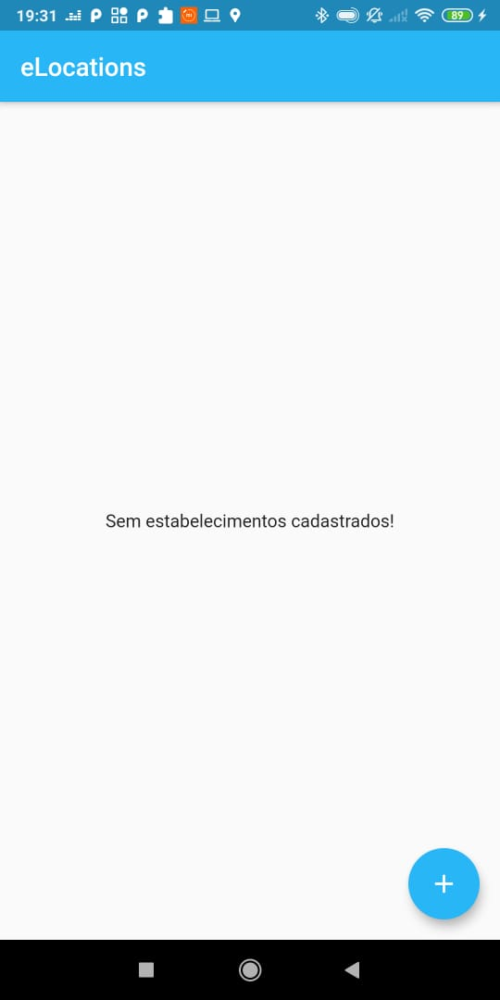
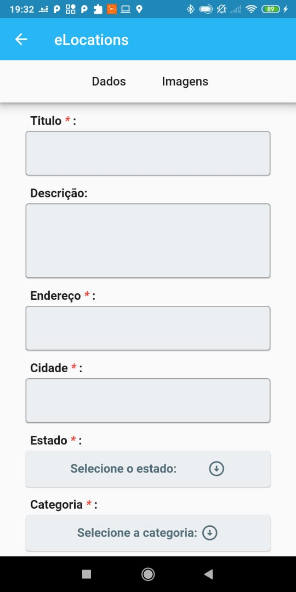
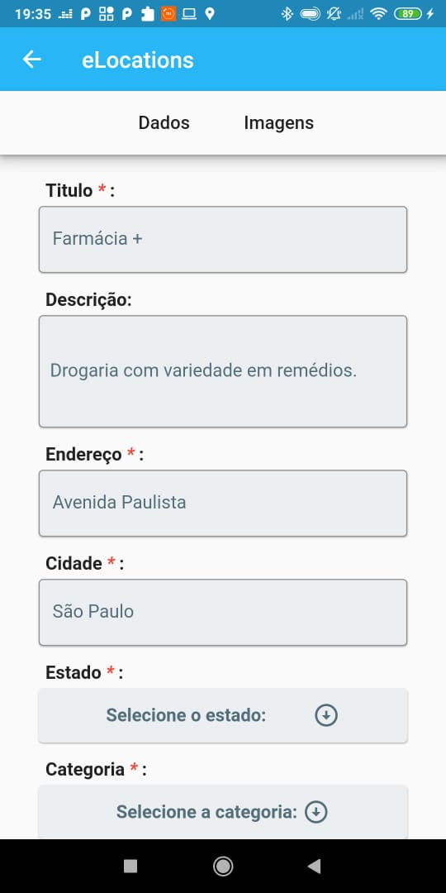
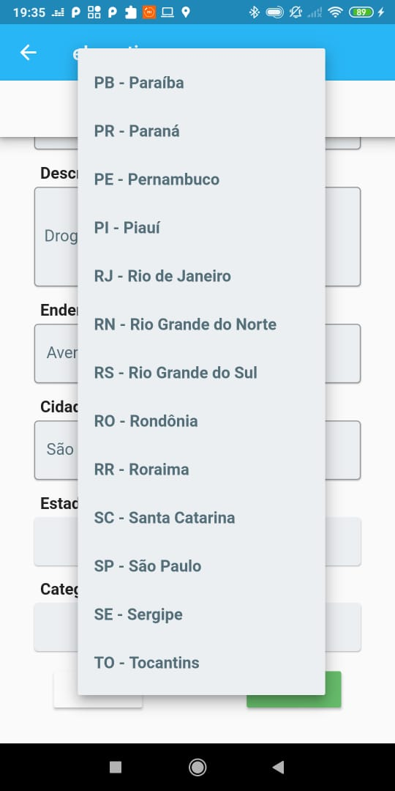
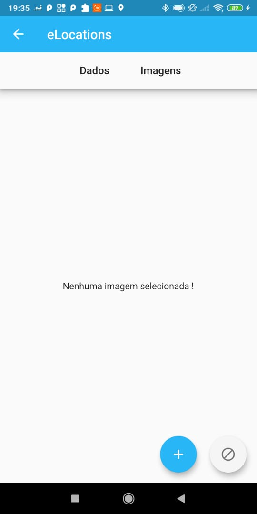
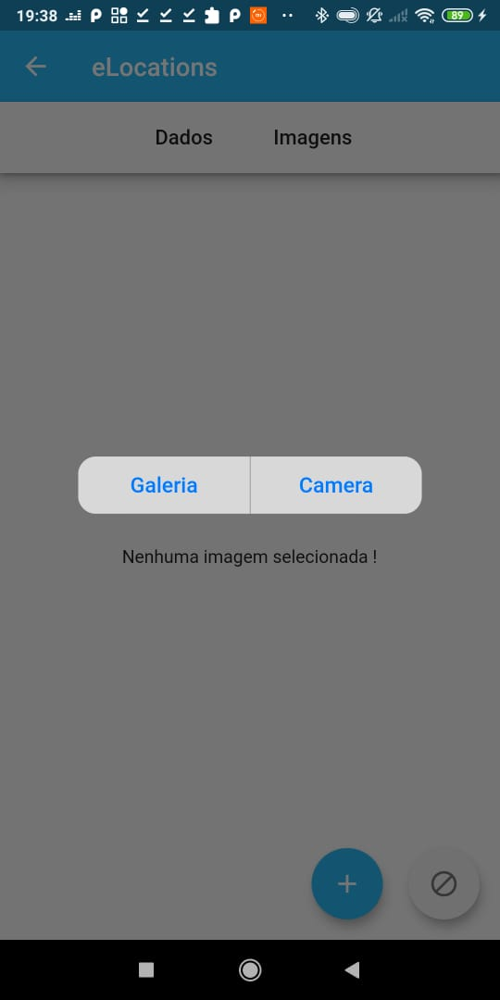
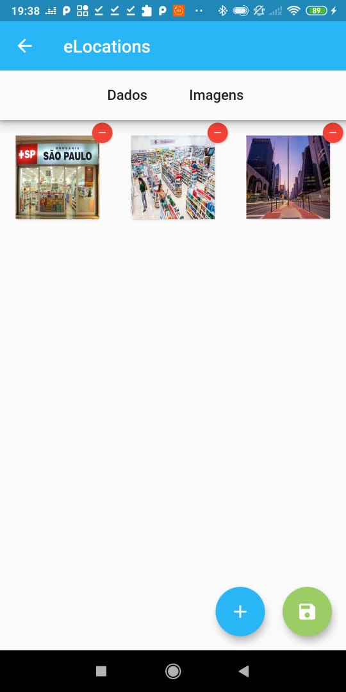
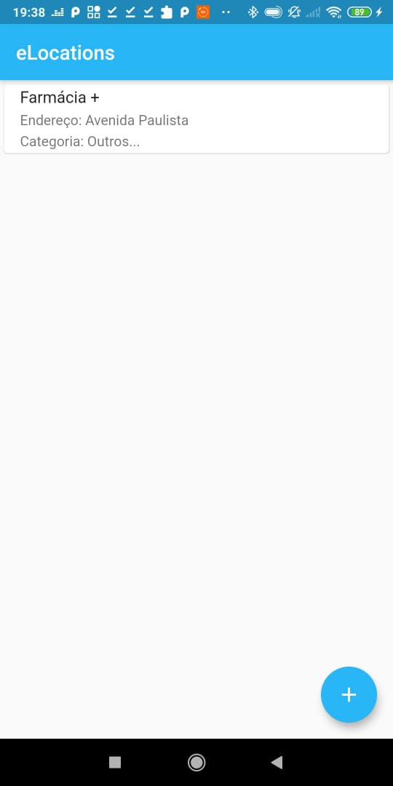

<p align="center">
<p>
    
</p>
</p>
<p align="center">
  
## eLocations_app

## Sobre 📖
  Aplicativo desenvolvido na linguagem Dart e framework Flutter com objetivo de cadastro, editão e deleção de estabelecimento.
  Banco de dados interno com sqlite, e bibliotecas como badge, image_picker, flutter_staggered_grid_view, path_provider.
</p>

## Previews 📱
<p align="center">
  
  
  
  
  
  
  
  
</p>

# Como usar

	```  - Clone this repository:
	``` $ git clone https://github.com/JhonataCustodio/eLocation-crud-app.git

	``` - Enter in directory:
	``` $ cd eLocation_app

	``` - For install dependencies:
	``` $ flutter pub get

	``` - Run the app: 
	``` $ flutter run

